# AÛRA — AI-Powered Luxury Beauty Concierge Platform

<p align="center">
  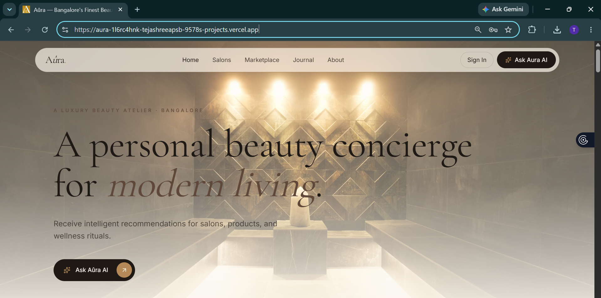
</p>

<p align="center">
  <strong>Luxury Beauty Discovery • AI Concierge • Salon Marketplace • Beauty Marketplace • Editorial Beauty Journal</strong>
</p>

<p align="center">
  <a href="https://aura-1l6rc4hnk-tejashreeapsb-9578s-projects.vercel.app/">Live Application</a> |
  <a href="https://github.com/tejashree2405/aura">Source Code</a>
</p>

---

## Live Demo

### Frontend

https://aura-1l6rc4hnk-tejashreeapsb-9578s-projects.vercel.app/

### Backend API

https://aura-production-6fdf.up.railway.app/health

### GitHub Repository

https://github.com/tejashree2405/aura

---

# Overview

AÛRA is a full-stack AI-powered luxury beauty concierge platform that combines:

- AI Beauty Consultation
- Personalized Beauty Profiles
- Salon Discovery & Booking
- Premium Beauty Marketplace
- Beauty Editorial Journal
- Order & Appointment Management
- Profile Personalization
- Admin Management System

The platform is designed around a luxury editorial experience inspired by brands such as Vogue, Dior Beauty, Aesop, and modern concierge services.

---

# Problem Statement

Beauty recommendations are often fragmented across:

- Search engines
- Salon websites
- Product marketplaces
- Social media platforms
- Beauty blogs

Users struggle to receive personalized recommendations tailored to their unique beauty concerns and preferences.

AÛRA solves this by centralizing beauty discovery, recommendations, consultation, and management into a single intelligent platform.

---

# Key Features

## Authentication System

Secure user authentication powered by JWT and HTTP-only cookies.

### Features

- User Registration
- User Login
- User Logout
- Protected Routes
- Persistent Sessions
- User Profile Management

<p align="center">
  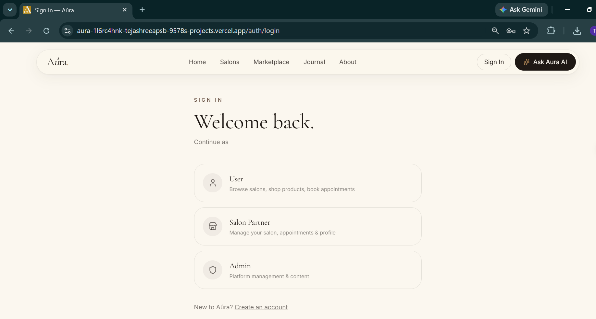
</p>

---

## AI Beauty Concierge

The core feature of AÛRA.

Users can interact with an intelligent beauty concierge capable of providing:

- Personalized skincare guidance
- Haircare recommendations
- Salon suggestions
- Bridal beauty consultations
- Product pairing assistance
- Wellness ritual planning

### Features

- Conversation History
- Session Management
- Search Previous Consultations
- Beauty Profile Integration
- Persistent AI Conversations

<p align="center">
  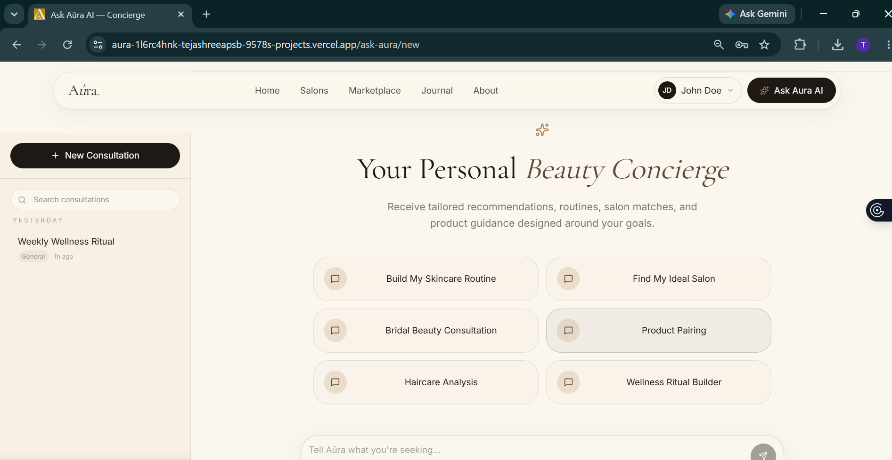
</p>

<p align="center">
  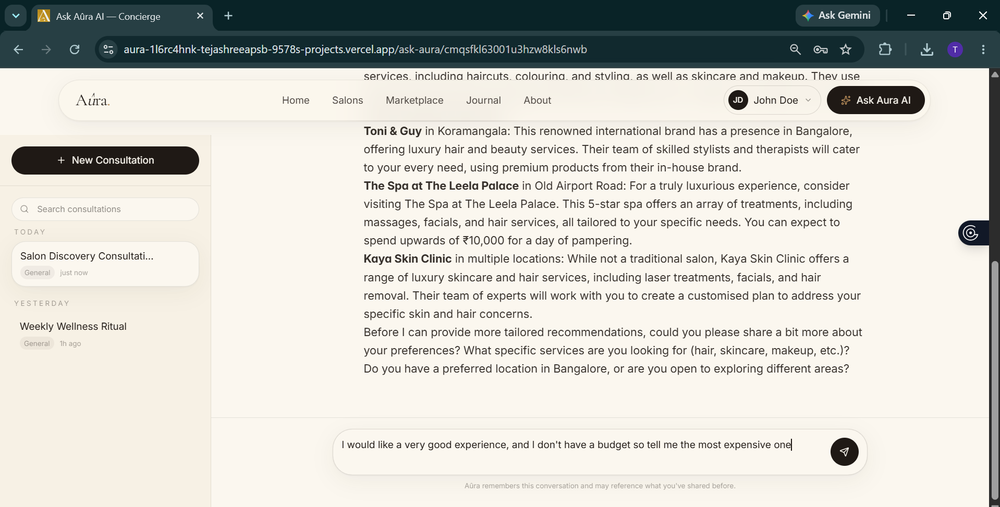
</p>

---

## Salon Discovery Platform

Luxury salon marketplace experience.

### Features

- Browse Salons
- Salon Detail Pages
- Service Listings
- Contact Information
- Appointment Booking
- Personalized Recommendations

<p align="center">
  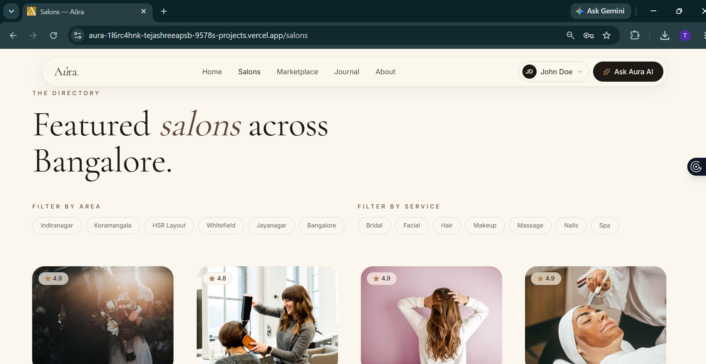
</p>

<p align="center">
  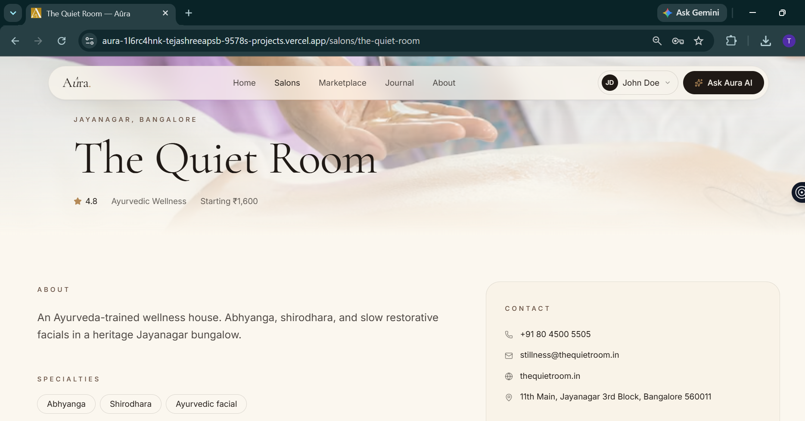
</p>

---

## Beauty Marketplace

Curated beauty product discovery and management.

### Features

- Product Catalog
- Product Detail Pages
- Product Categories
- Product Filtering
- Shopping Experience
- Order Creation

<p align="center">
  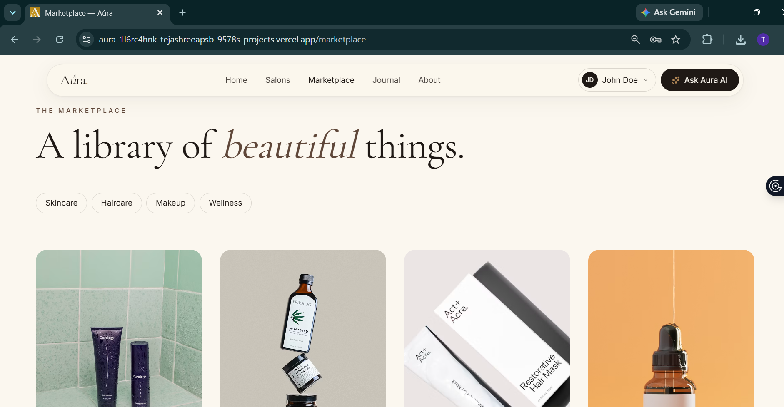
</p>

<p align="center">
  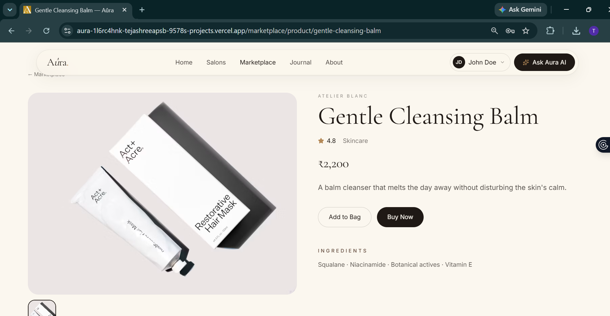
</p>

---

## Beauty Journal

Editorial beauty content experience.

### Categories

- Skincare
- Haircare
- Wellness
- Bridal Beauty
- Luxury Beauty

<p align="center">
  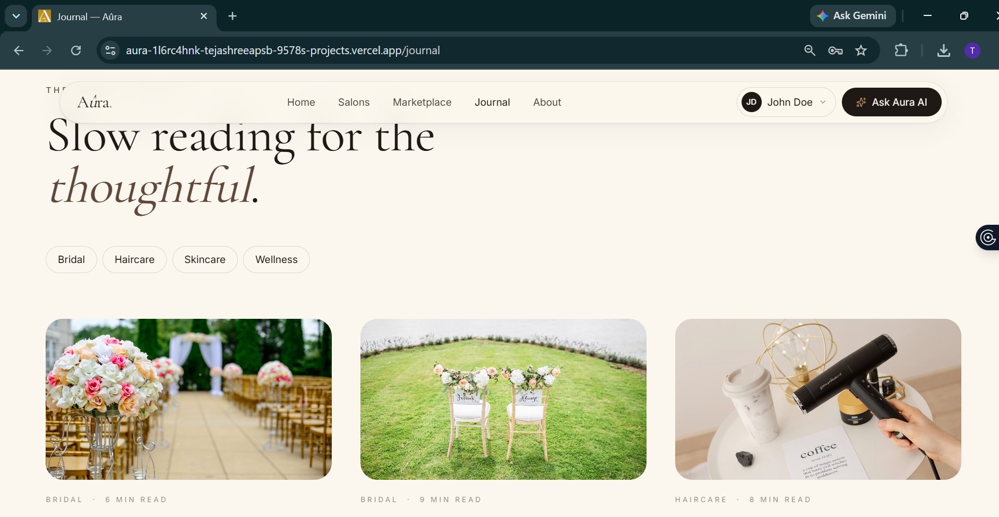
</p>

---

## User Dashboard

Personalized user experience.

### Features

- Beauty Profile Management
- Address Management
- Order Tracking
- Appointment Tracking
- Profile Image Upload
- Session History

<p align="center">
  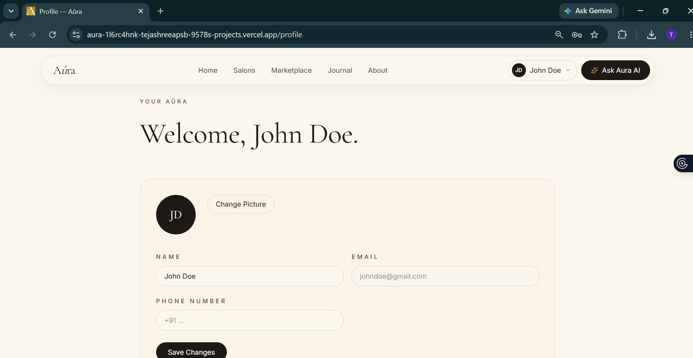
</p>

---

## Admin Dashboard

Complete administrative management system.

### User Management

- View Users
- Delete Users

### Product Management

- Create Products
- Update Products
- Delete Products
- Restore Products

### Journal Management

- Create Journals
- Edit Journals
- Delete Journals

### Salon Management

- Manage Salons
- Approve Salons
- Update Salons

### Order Management

- Update Order Status
- Monitor Orders

<p align="center">
  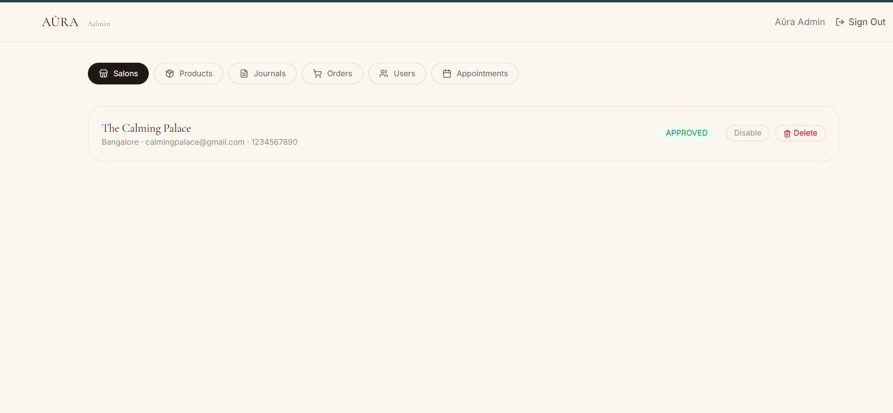
</p>

---

# System Architecture

```text
┌───────────────────────────────┐
│          Frontend             │
│ React + TypeScript + Vite     │
└───────────────┬───────────────┘
                │
                ▼
┌───────────────────────────────┐
│      Express Backend API      │
│        Node.js Server         │
└───────────────┬───────────────┘
                │
     ┌──────────┼──────────┐
     ▼          ▼          ▼

 PostgreSQL   Cloudinary   Groq AI
    Neon        Media       LLM

     │
     ▼

 Prisma ORM
```

---

# Tech Stack

## Frontend

- React 19
- TypeScript
- Vite
- TanStack Router
- Tailwind CSS
- Shadcn UI
- Radix UI
- Lucide React

## Backend

- Node.js
- Express.js
- TypeScript

## Database

- PostgreSQL
- Neon PostgreSQL

## ORM

- Prisma ORM

## Authentication

- JWT
- HTTP-only Cookies
- bcryptjs

## AI

- Groq API
- Llama 3.3 70B Versatile

## Media Storage

- Cloudinary

## Deployment

- Vercel
- Railway
- Neon
- Cloudinary

---

# Database Models

## User

```text
id
name
email
passwordHash
phone
profileImage
createdAt
updatedAt
```

## BeautyProfile

```text
id
userId
skinType
hairType
concerns
preferences
```

## Conversation

```text
id
userId
title
createdAt
```

## Message

```text
id
conversationId
role
content
createdAt
```

## Address

```text
id
userId
city
state
country
```

## Appointment

```text
id
userId
salonId
date
status
```

## Order

```text
id
userId
total
status
createdAt
```

---

# API Endpoints

## Authentication

```http
POST /auth/signup
POST /auth/login
POST /auth/logout

GET /auth/me
PATCH /auth/me

POST /auth/profile-image
```

## AI

```http
GET /ai/sessions
POST /ai/sessions

GET /ai/sessions/:id
PUT /ai/sessions/:id
DELETE /ai/sessions/:id

POST /ai/chat

GET /ai/profile
POST /ai/profile
```

## Orders

```http
GET /orders
POST /orders
GET /orders/:id
```

## Appointments

```http
GET /appointments
POST /appointments
PUT /appointments/:id
```

## Admin

```http
GET /admin/users
GET /admin/orders
GET /admin/products
GET /admin/journals
GET /admin/salons
```

---

# Environment Variables

## Frontend

```env
VITE_API_URL=
VITE_SUPABASE_URL=
VITE_SUPABASE_PUBLISHABLE_KEY=
```

## Backend

```env
DATABASE_URL=
JWT_SECRET=
GROQ_API_KEY=
CLOUDINARY_CLOUD_NAME=
CLOUDINARY_API_KEY=
CLOUDINARY_API_SECRET=
```

---

# Local Installation

Clone the repository

```bash
git clone https://github.com/tejashree2405/aura.git
cd aura
```

Install frontend dependencies

```bash
npm install
```

Run frontend

```bash
npm run dev
```

Setup backend

```bash
cd backend
npm install
```

Generate Prisma client

```bash
npx prisma generate
```

Run migrations

```bash
npx prisma migrate deploy
```

Start backend

```bash
npm run dev
```

---

# Deployment

### Frontend

Hosted on Vercel

### Backend

Hosted on Railway

### Database

Hosted on Neon PostgreSQL

### Media Storage

Hosted on Cloudinary

---

# Future Enhancements

- AI Skin Analysis
- Product Recommendation Engine
- Vector Search & RAG
- Real-time Appointment Availability
- Payment Gateway Integration
- Mobile Application
- Salon Analytics Dashboard
- Recommendation Analytics

---

# Project Highlights

- Full-Stack Application
- AI Integration
- Authentication System
- Cloud Storage Integration
- Database Persistence
- Session Management
- Admin Dashboard
- Modern UI/UX
- Responsive Design
- Production Deployment

---

# Author

**Tejashree Venkatesh**

GitHub: https://github.com/tejashree2405

LinkedIn: https://www.linkedin.com/in/tejashree-v/

Live Application: https://aura-1l6rc4hnk-tejashreeapsb-9578s-projects.vercel.app/